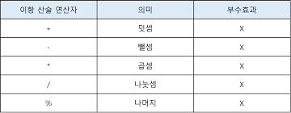
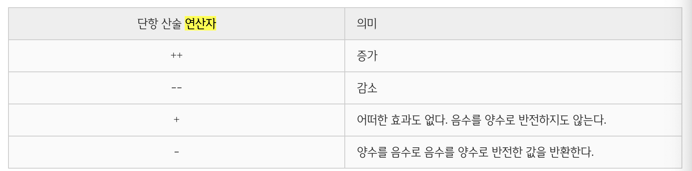

# [22/07/28] 07장 연산자

- 연산자는 하나 이상의 표현식을 대상으로 산술, 할당, 비교, 논리, 타입, 지수 연산 등을 수행해 하나의 값을 만든다.
- 피연산자: 값, 연산의 대상
- 연산자: 피연산자를 연산하여 새로운 값을 만든다.

## 1. 산술 연산자

- 산술 연산이 불가능한 경우 `NaN`을 반환
- `피연산자의 개수`에 따라 `이항 산술 연산자`와 `단항 산술 연산자`로 구분할 수 있다.

### 1-1. 이항 산술 연산자(피연산자 개수 2개 이상)

- 이항산술 연산자는 2개의 피연산자를 산술 연산하여 값을 만든다.
- 모든 이항 산술 연산자는 피연산자의 값을 변경하는 `부수효과(side effect)가 없다.` 다시 말해, 어떤 산술 연산을 해도 피연산자의 값이 바뀌는 경우는 없고 언제나 `새로운 값`을 만들 뿐인다.



### 1-2. 단항 산술 연산자(피연산자 개수 1개)

- 단항 산술 연산자는 `1개의 피연산자`를 산술 연산하여 숫자 값을 만든다.



#### [증가/감소 연산자]

- 이항 산술 연산자와 달리 `증가/감소 연산자`는 피연산자의 값을 변경하는 `부수효과가 있다.`
- 증가/감소 연산을 하면 피연산자의 값을 변경하는 `암묵적 할당`이 이뤄진다.

```javascript
var x = 1;

// ++ 연산자는 피연산자의 값을 변경하는 암묵적 할당이 이뤄진다.
x++; // x = x + 1;
console.log(x); // 2

// -- 연산자는 피연산자의 값을 변경하는 암묵적 할당이 이뤄진다.
x--; // x = x - 1;
console.log(x); // 1
```

- 증가/감소 연산자는 위치에 의미가 있다.
  > 앞(전위 증가/감소 연산자): 먼저 피연산자의 `값을 증가/감소`시킨 후, 다른 `연산`을 수행<br>
  > 뒤(후위 증가/감소 연산자): 먼저 다른 `연산`을 수행한 후, 피연산자의 `값을 증가/감소`

```javascript
var x = 5,
  result;

// 선할당 후증가(postfix increment operator)
result = x++;
console.log(result, x); // 5 6

// 선증가 후할당(prefix increment operator)
result = ++x;
console.log(result, x); // 7 7

// 선할당 후감소(postfix decrement operator)
result = x--;
console.log(result, x); // 7 6

// 선감소 후할당 (prefix decrement operator)
result = --x;
console.log(result, x); // 5 5
```

#### [+ 단항 연산자]

- '+' 단항 연산자는 피연산자에 어떠한 `효과도 없다.` 음수를 양수로 반전하지도 않는다.
- 하지만 숫자 타입이 아닌 피연산자에 +연산을 사용하면 숫자 타입으로 변환된 값을 반환한다.`(부수효과는 없음)`

```javascript
var x = "1";

// 문자열을 숫자로 타입 변환한다.
console.log(+x); // 1
// 부수 효과는 없다.
console.log(x); // "1"

// 불리언 값을 숫자로 타입 변환한다.
x = true;
console.log(+x); // 1
// 부수 효과는 없다.
console.log(x); // true

// 불리언 값을 숫자로 타입 변환한다.
x = false;
console.log(+x); // 0
// 부수 효과는 없다.
console.log(x); // false

// 문자열을 숫자로 타입 변환할 수 없으므로 NaN을 반환한다.
x = "Hello";
console.log(+x); // NaN
// 부수 효과는 없다.
console.log(x); // "Hello"
```

#### [- 단항 연산자]

- '-' 단항 연산자는 피연산자의 `부호를 반전한 값`을 반환한다.
- '+' 단항 연산자와 같이 숫자 타입이 아닌 피연산자에 사용하면 숫자 타입으로 변환하여 반환한다.
- 피연산자를 변경하는 것은 아니고 부호를 반전한 값을 생성해 반환한다.`(부수효과는 없음)`

```javascript
// 부호를 반전한다.
-(-10); // -> 10

// 문자열을 숫자로 타입 변환한다.
-"10"; // -> -10
-"-10"; // -> 10

// 불리언 값을 숫자로 타입 변환한다.
-true; // -> -1

// 문자열은 숫자로 타입 변환할 수 없으므로 NaN을 반환한다.
-"Hello"; // -> NaN
```

### 1-3. 문자열 연결 연산자

- '+'연산자는 피연산자 중 하나 이상이 문자열인 경우 문자열 연결 연산자로 동작한다.

```javascript
// 문자열 연결 연산자
"1" + 2; // -> '12'
1 + "2"; // -> '12'

// 산술 연산자
1 + 2; // -> 3

// true는 1로 타입 변환된다.
// 암묵적으로 true를 숫자 타입인 1로 타입을 강제 변환 후 연산을 수행한다.(암묵적 타입 변환, 타입 강제 변환)
1 + true; // -> 2

// false는 0으로 타입 변환된다.
1 + false; // -> 1

// null은 0으로 타입 변환된다.
1 + null; // -> 1

// undefined는 숫자로 타입 변환되지 않는다.
+undefined; // -> NaN
1 + undefined; // -> NaN

// 반대로 문자열앞에 +를 붙이면 숫자 타입으로 변환된다.
2 + +"1"; // 3
```

## 2. 할당 연산자

- 우항에 있는 피연산자의 평가 결과를 좌항에 있는 변수에 할당한다.
- 좌항의 변수에 값을 할당하므로 부수효과가 있다.
  

```javascript
var x;

x = 10;
console.log(x); // 10

x += 5; // x = x + 5;
console.log(x); // 15

x -= 5; // x = x - 5;
console.log(x); // 10

x *= 5; // x = x * 5;
console.log(x); // 50

x /= 5; // x = x / 5;
console.log(x); // 10

x %= 5; // x = x % 5;
console.log(x); // 0

var str = "My name is ";

// 문자열 연결 연산자
str += "Lee"; // str = str + 'Lee';
console.log(str); // 'My name is Lee'
```

## 3. 비교 연산자

- 좌항과 우항의 피연산자를 비교한 다음 그 결과를 `불리언 값`으로 반환한다.
  

### 3.1 동등/일치 비교 연산자

- 좌항과 우항의 피연산자가 같은 값으로 평가되는지 비교하고 불리언 값으로 반환
- 비교의 엄격성 정도가 다름

#### [동등 비교(==)]

- 느슨한 비교
- 좌항과 우항의 피연산자를 비교할 때 먼저 `암묵적 타입 변환`을 통해 `타입을 일치`시킨 후 같은 값인지 `비교`

```javascript
// 동등 비교
5 == 5; // -> true

// 타입은 다르지만 암묵적 타입 변환을 통해 타입을 일치시키면 동등하다.
5 == "5"; // -> true
```

다음 예제는 결과예측이 어려워 실수하기 쉬운 '안티패턴'이므로 참고만 하자.

```javascript
// 동등 비교. 결과를 예측하기 어렵다.
"0" == ""; // -> false
0 == ""; // -> true
0 == "0"; // -> true
false == "false"; // -> false
false == "0"; // -> true
false == null; // -> false
false == undefined; // -> false
```

#### [일치 비교(===)]

- 엄격한 비교
- 좌항과 우항의 피연산자가 `타입`도 같고 `값`도 같은 경우에 한하여 true를 반환한다.

```javascript
// 일치 비교
5 === 5; // -> true

// 암묵적 타입 변환을 하지 않고 값을 비교한다.
// 즉, 값과 타입이 모두 같은 경우만 true를 반환한다.
5 === "5"; // -> false
```

> 주의할 점1: NaN
>
> - 그래서 isNaN()함수,Number.isNaN()메서드를 이용해 비교하는 것이 좋다.

```javascript
// NaN은 자신과 일치하지 않는 유일한 값이다.
NaN === NaN; // -> false
```

> 주의할 점2: 숫자 0
>
> - 그래서 가장 정확한것은 object.is()메서드를 활용하는 것이다.

```javascript
// 양의 0과 음의 0의 비교. 일치 비교/동등 비교 모두 결과는 true이다.
0 === -0; // -> true
0 == -0; // -> true

-0 === +0; // -> true
Object.is(-0, +0); // -> false

NaN === NaN; // -> false
Object.is(NaN, NaN); // -> true
```

#### [부동등 비교]

```javascript
// 부동등 비교
5 != 8; // -> true
5 != 5; // -> false
5 != "5"; // -> false

// 불일치 비교
5 !== 8; // -> true
5 !== 5; // -> false
5 !== "5"; // -> true
```

### 3.2 대소 관계 비교 연산자


## 4. 삼항 조건 연산자

- 조건식의 평가 결과에 따라 반환할 값을 결정한다. `부수효과는 없다`
- 첫 번째 피연산자는 조건식, 즉 불리언 타입의 값으로 평가될 표현식이다.
- 만약 평가 결과가 불리언 값이 아니면 불리언 값으로 암묵적 타입 변환된다.

```javascript
var x = 2,
  result;

// 2 % 2는 0이고 0은 false로 암묵적 타입 변환된다.
if (x % 2) result = "홀수";
else result = "짝수";

console.log(result); // 짝수
```

#### [if..else문]

- if...else문은 `표현식이 아니고 문`이기 때문에 `값`처럼 사용할 수 없다.
- 그래서 결과가 `SyntaxError: Unexpected token if`라고 나옴

```javascript
var x = 10;

// if...else 문은 표현식이 아닌 문이다. 따라서 값처럼 사용할 수 없다.
var result = if (x % 2) { result = '홀수'; } else { result = '짝수'; };
// SyntaxError: Unexpected token if
```

## 5. 논리 연산자

- 우항과 좌항의 피연산자(부정 논리 연산자의 경우 우항의 피연산자)를 논리 연산한다.
  

```javascript
// 논리합(||) 연산자
true || true; // -> true
true || false; // -> true
false || true; // -> true
false || false; // -> false

// 논리곱(&&) 연산자
true && true; // -> true
true && false; // -> false
false && true; // -> false
false && false; // -> false

// 논리 부정(!) 연산자
!true; // -> false
!false; // -> true
```

- 논리 부정(!) 연산자는 언제나 불리언 값을 반환한다.
- 피연산자가 불리언 값이 아니면 불리언 타입으로 암묵적 타입 변환된다.

```javascript
// 암묵적 타입 변환
!0; // -> true
!"Hello"; // -> false
```

- 평가 결과가 불리언 타입 값이 아닐 수도 있다. 논리합(||) 또는 논리곱(&&) 연산자 표현식은 언제나 2개의 피연산자 중 어느 한쪽으로 평가된다.

```javascript
// 단축 평가
"Cat" && "Dog"; // -> 'Dog'
```

## 6. 쉼표 연산자

- 왼쪽 피연산자부터 차례대로 피연산자를 평가하고 `마지막 피연산자`의 평가가 끝나면 `마지막 피연산자`의 평가 결과를 반환한다.

```javascript
var x, y, z;
(x = 1), (y = 2), (z = 3); // 3

// 이를 응용하여 함수를 만들어보자면
function add() {
  return (a = 1), (b = 2), console.log(a + b), a + b;
}
add(); // 3 3
```

## 7. 그룹 연산자

- `소괄호(())`로 피연산자를 감싸는 그룹 연산자는 자신의 피연산자인 표현식을 가장 먼저 평가한다.

```javascript
10 * 2 + 3; // -> 23

// 그룹 연산자를 사용하여 우선순위를 조절
10 * (2 + 3); // -> 50
```

## 8. typeof 연산자

- typeof연산자는 `피연산자의 데이터 타입`을 문자열로 반환한다.

```javascript
typeof ""; // -> "string"
typeof 1; // -> "number"
typeof NaN; // -> "number"
typeof true; // -> "boolean"
typeof undefined; // -> "undefined"
typeof Symbol(); // -> "symbol"
typeof null; // -> "object"
typeof []; // -> "object"
typeof {}; // -> "object"
typeof new Date(); // -> "object"
typeof /test/gi; // -> "object"
typeof function () {}; // -> "function"
```

- typeof연산자로 null값을 연산해 보면 null이 아닌 object를 반환한다는 것을 주의. null을 확인할 때는 typeof대신 `일치연산자(===)`를 사용하는것이 좋다.

```javascript
var foo = null;

typeof foo === null; // -> false
foo === null; // -> true
```

## 9. 지수 연산자

- ES7에서 도입된 지수 연산자는 좌항의 피연산자를 밑으로, 우항의 피연산자를 지수로 거틉 제곱하여 숫자 값을 반환한다.
- Math.pow()와 동일하다
- `Math.pow()`를 쓰는것이 가독성에 좋다.
- 연산자 중에서 우선순위가 가장 높다.

```javascript
2 ** 2; // -> 4
2 ** 2.5; // -> 5.65685424949238
2 ** 0; // -> 1
2 ** -2; // -> 0.25

Math.pow(2, 2); // -> 4
Math.pow(2, 2.5); // -> 5.65685424949238
Math.pow(2, 0); // -> 1
Math.pow(2, -2); // -> 0.25
```

- 음수를 거듭제곱 밑으로 사용해 계산하려면 `괄호`로 묶어야 한다.

```javascript
-5 ** 2;
//SyntaxError

(-5) ** 2;
```

## 10. 그 외의 연산자


## 11. 연산자의 부수 효과

- 부수 효과가 있는 연산자는 `할당 연산자(=)`, `증가/감소 연산자(++/--)`, `delete 연산자`다.

## 12. 연산자 우선 순위


## 13. 연산자 결합 순서


