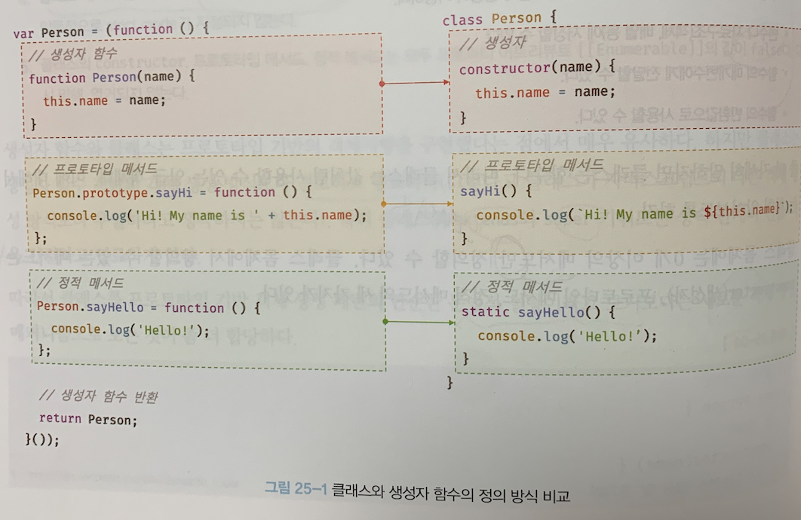

# [22/09/05] 25장 클래스

## 1. 클래스는 프로토타입의 문법적 설탕인가?

자바스크립트는 `프로토타입 기반 객체지향 언어`다.
프로토타입 기반 객체지향 언어는 `클래스가 필요 없는(class free)`객체지향 프로그래밍 언어다.
ES5에서는 클래스 없이도 아래와 같이 `생성자 함수`와 `프로토타입`을 통해 객체지향 언어의 `상속`을 구현할 수 있다.

```javascript
// ES5 생성자 함수
var Person = (function () {
  // 생성자 함수
  function Person(name) {
    this.name = name;
  }

  // 프로토타입 메서드
  Person.prototype.sayHi = function () {
    console.log("Hi! My name is " + this.name);
  };

  // 생성자 함수 반환
  return Person;
})();

// 인스턴스 생성
var me = new Person("Lee");
me.sayHi(); // Hi! My name is Lee
```

- ES6에서 클래스 도입 -> 기존 폐지가 아님

  > ES6에서 추가된 클래스가 기존의 프로토타입 기반 객체지향 모델을 폐지하고 새롭게 클래스 기반 객체지향 모델을 제공하는 것은 아니다.

- 기존 프로토타입 기반 패턴을 클래스 기반 패턴처럼 사용가능하게 함

  > `클래스는 함수`이며 `기존 프로토타입 기반 패턴을 클래스 기반 패턴`처럼 사용할 수 있도록 하는 `문법적 설탕(syntactic sugar)`이라고 볼 수도 있다.

- 클래 스 ≒ 생성자함수(완전히 동일하지는 않음)
  > 클래스와 생성자 함수는 모두 프로토타입 기반의 인스턴스를 생성하지만 정확히 동일하게 동작하지는 않는다.

차이점은 아래와 같다.

1. 클래스를 new연산자 없이 호출하면 에러가 발생한다.(생성자 함수를 new연산자 없이 호출하면 일반 함수로 호출된다.)
2. 클래스는 상속을 지원하는 extends와 super키워드를 제공한다.(생성자 함수는 지원하지 않는다.)
3. 클래스는 호이스팅이 발생하지 않는 것처럼 동작한다.(함수 선언문은 함수 호이스팅, 함수 표현식은 변수 호이스팅이 발생한다.)
4. 클래스 내의 모든 코드에는 암묵적으로 strict mode가 지정되어 실행되며 해제할 수 없다.(생성자 함수는 지정되지 않는다.)
5. 클래스의 constructor, 프로토타입 메서드, 정적 메서드는 열거되지 않는다.(모두 프로퍼티 어트리뷰트 [[Enumerable]]의 값이 false다.)

## 2. 클래스 정의

- 클래스는 `class키워드`를 사용항여 정의한다.
- 클래스 이름은 생성자 함수와 마찬가지로 `파스칼 케이스`를 사용하는 것이 일반적이다. (하지만 사용하지 않아도 에러가 발생하지는 않는다.)

```javascript
// 클래스 선언문
class Person {}
```

- 표현식으로 클래스를 정의할 수도 있다.(일반적이지 않음, 익명 혹은 기명 모두 가능하다.)

```javascript
// 익명 클래스 표현식
const Person = class {};

// 기명 클래스 표현식
const Person = class MyClass {};
```

- 클래스는 `일급 객체`이다.(클래스를 표현식으로 정의할 수 있다는 것이 일급 객체임을 의미한다.)

> ※ 일급 객체의 특징
>
> - 무명의 리터럴로 생성할 수 있다.(즉, 런타임에 생성이 가능하다.)
> - 변수나 자료구조(객체, 배열등)에 저장할 수 있다.
> - 함수의 매개변수에게 전달할 수 있다.
> - 함수의 반환값으로 사용할 수 있다.

- 클래스는 `함수`다. 따라서 클래스는 `값처럼 사용할 수 있는` 일급 객체다.
- 클래스 몸체는 0개 이상의 메서드만 정의할 수 있다.
- 클래스 몸체에서 정의할 수 있는 메서드는 `constructor, 프로토타입 메서드, 정적 메서드` 세 가지가 있다.

```javascript
// 클래스 선언문
class Person {
  // 생성자
  constructor(name) {
    // 인스턴스 생성 및 초기화
    this.name = name; // name 프로퍼티는 public하다.
  }

  // 프로토타입 메서드
  sayHi() {
    console.log(`Hi! My name is ${this.name}`);
  }

  // 정적 메서드
  static sayHello() {
    console.log("Hello!");
  }
}

// 인스턴스 생성
const me = new Person("Lee");

// 인스턴스의 프로퍼티 참조
console.log(me.name); // Lee
// 프로토타입 메서드 호출
me.sayHi(); // Hi! My name is Lee
// 정적 메서드 호출
Person.sayHello(); // Hello!
```

생성자 함수와 클래스 비교



## 3. 클래스 호이스팅

클래스는 함수로 평가된다.

```javascript
// 클래스 선언문
class Person {}

console.log(typeof Person); // function
```

클래스 선언문으로 정의한 클래스는 함수 선언문과 같이 소스코드 평가 과정, 즉 런타임 이전에 먼저 평가되어 함수 객체를 생성한다.

클래스 선언문은 const, let과 같이 호이스팅이 발생되지만 발생하지 않는 것처럼 보인다.

```javascript
console.log(Person);
// ReferenceError: Cannot access 'Person' before initialization

//클래스 선언문
class Person {}
```

```javascript
const Person = "";

{
  // 호이스팅이 발생하지 않는다면 ''이 출력되어야 한다.
  console.log(Person);
  // ReferenceError: Cannot access 'Person' before initialization

  // 클래스 선언문
  class Person {}
}
```

즉, var, let, const, function, function\*, class키워드를 사용하여 선언된 모든 식별자는 `호이스팅된다`. 모든 선언문은 런타임 이전에 먼저 실행되기 때문이다.

## 4. 인스턴스 생성

클래스는 `생성자 함수`이며 `new연산자와 함께` 호출되어 인스턴스를 생성한다.

```javascript
class Person {}

// 인스턴스 생성
const me = new Person();
console.log(me); // Person {}
```

클래스는 new연산자와 함께 생성자 함수로 호출되어야만 인스턴스를 생성할 수 있다.(다른방법 없음)

```javascript
class Person {}

// 클래스를 new 연산자 없이 호출하면 타입 에러가 발생한다.
const me = Person();
// TypeError: Class constructor Foo cannot be invoked without 'new'
```

클래스 표현식으로 정의된 클래스의 경우 식별자를 사용해야한다.
기명 클래스의 클래스 이름을 사용해 생성하려고 하면 에러가 발생한다.

```javascript
const Person = class MyClass {};

// 함수 표현식과 마찬가지로 클래스를 가리키는 식별자로 인스턴스를 생성해야 한다.
const me = new Person();

// 클래스 이름 MyClass는 함수와 동일하게 클래스 몸체 내부에서만 유효한 식별자다.
console.log(MyClass); // ReferenceError: MyClass is not defined

const you = new MyClass(); // ReferenceError: MyClass is not defined
```
