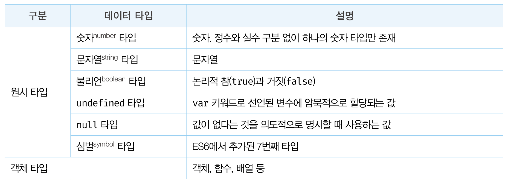
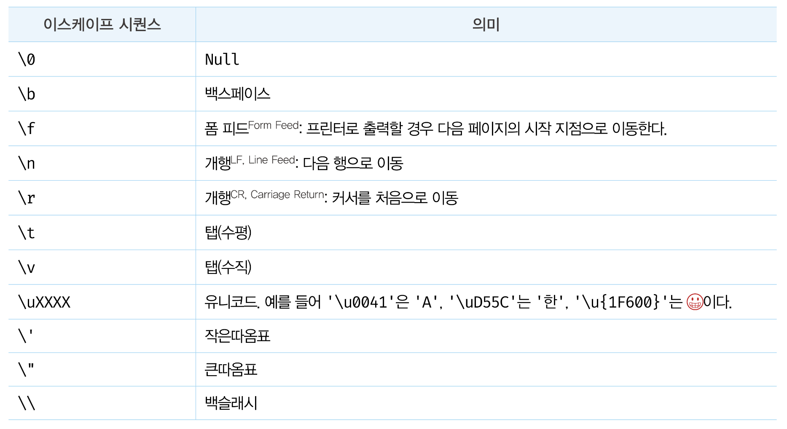
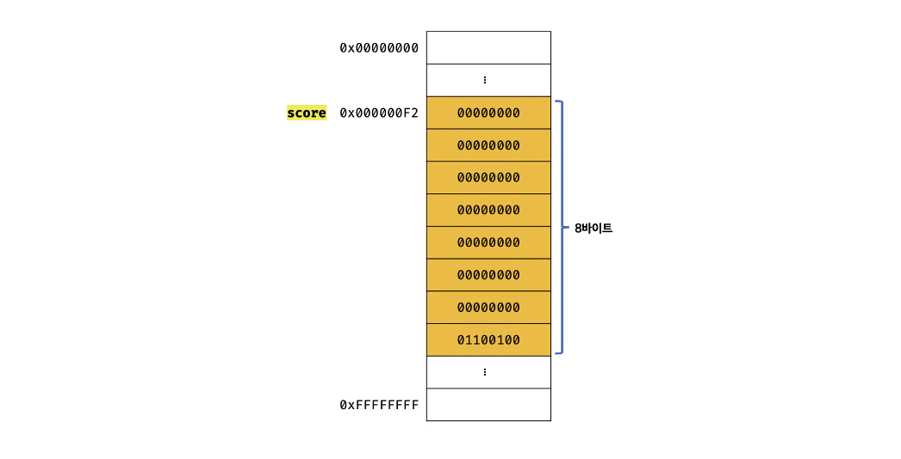

# [22/07/27] 06장 데이터 타입



## 1. 숫자타입

- C와 자바와 다르게 JS는 하나의 숫자 타입만 존재 - 모든 수를 `실수`로 처리
- 정수, 실수. 2진수, 8진수, 16진수 리터럴은 모두 `배정밀도 64비트 부동소수점 형식의 2진수`로 저장된다.

```javascript
//어차피 모두 실수로 처리!!!
var integer = 10; //정수
var double = 10.12; //실수
var negative = -20; //음의 정수
console.log(1 === 1.0); //true
```

- 세 가지 특별한 값으로 처리

```javascript
console.log(10 / 0); //Infinity
console.log(10 / -0); //-Infinity
console.log(1 * "String"); //NaN(산술 연산 불가)
```

- 자바스크립는 대소문자를 구별하므로 NaN을 `NAN, Nan, nan`으로 표현하면 `에러`가 발생
- 자바스크립트 엔진은 NAN, Nan, nan을 값이 아닌 `식별자`로 해석한다.

## 2. 문자열 타입

- 작은따옴표(''), 큰따옴표(""), 백틱(``) `백틱은 ES6 이후 도입`을 사용 - 그 중에 작은따옴표가 일반적임
- Text 데이터

```javascript
string = '작은따옴표로 감싼 문자열 내의 "큰따옴표"는 문자열로 인식된다.';
string = "큰따옴표로 감싼 문자열 내의 '작은따옴표'는 문자열로 인식된다.";
```

- 따옴표로 문자열을 감싸지 않는다면 `공백문자` 포함시킬 수 없다.

## 3. 템플릿 리터럴

- ES6부터 `템플릿 리터럴`이라는 새로운 문자열 표기법이 도입
- `런타임`에 일반 문자열로 변환되어 처리
- ` 백틱(``) `을 사용

```javascript
var template = `Template literal`;
console.log(template); //Template literal
```

#### 3-1. 멀티라인 문자열

- 일반 문자열 내에서는 줄바꿈(개행)이 허용되지 않는 - `이스케이프 시퀀스`를 사용했어야 했다.
  
- 템플릿 리터럴 내에서는 이스케이프 시퀀스를 사용하지 않는다. `공백`도 그대로 적용된다.

```javascript
// 이스케이프 시퀀스를 사용해 작성한 HTML 문자열
var template1 = '<ul>\n\t<li><a href="#">Home</a></li>\n</ul>';

// 템플리 리터널 내에서 작성한 HTML 문자열
var template2 = `<ul>
	<li><a href="#">Home</a></li>
</ul>`;
```

[실행결과]

```javascript
<ul>
  <li>
    <a href="#">Home</a>
  </li>
</ul>
```

#### 3-2. 표현식 삽입

- 이전에는 문자열 `연산자 +`를 사용해 연결했다.
- 템플릿 리터럴에서는 `${}`으로 표현식을 감싼다.
- 표현식의 평가 결과가 문자열이 아니더라도 문자열로 타입이 강제 변환되어 삽입된다.

```javascript
var first = "Kozel";
var last = "dark";

// ES5 문자열 연결
console.log("My name is" + first + " " + last + ".");

// ES6 표현식 삽입
console.log(`My name is ${first} ${last}.`);

//결과는 'My name is Kozel dark.'로 동일하다.
```

## 4. 불리언 타입

- 불리언 타입의 값은 논리적 참, 거짓을 나타내는 true와 false뿐이며 `조건문`에서 자주 사용한다.

```javascript
var foo = true;
console.log(foo); // true

foo = false;
console.log(foo); // false
```

## 5. undefined 타입

- undefined 타입의 값은 undefined가 유일하다.
- `var 키워드`로 선언한 변수는 확보된 메모리 공간을 처음 할당이 이뤄질 때까지 `빈 상태`로 내버려두지 않고 자바스크립트 엔진이 암묵적으로 `undefined로 초기화`한다.
- 변수에 값이 없다는 것을 명시하고 싶을 땐 `null`을 할당한다.
- 자바스크립트의 경우 변수를 선언하면 암묵적으로 정의가 이뤄지기 때문에 선언과 정의의 구분이 모호하다.

## 6. null 타입

- null 타입의 값은 null이 유일하다.
- 대소문자를 구분하므로 null, NULL, Null 모두 다르다.
- null을 할당한다는 것은 변수가 이전에 참조하던 값을 더 이상 참조하지 않겠다는 의미
- 자바스크립트 엔진은 누구도 참조하지 않는 메모리 공간에 대해 가비지 콜렉션을 수행할 것이다.❓
- 유용해 보이지 않는다. 변수의 스코프를 좁게 만들어 변수 자체를 재빨리 소멸시키는 편이 낫다. ❓

## 7. 심벌 타입

- 심벌(symbol)은 ES6에서 추가된 7번째 타입으로, 변경 불가능한 원시 타입이다.
- 중복되지 않는 유일무이한 값, 외부 노출되지 않는 값
- Symbol 함수를 호출해 생성한다.

```javascript
var key = Symbol("key");
console.log(typeof key); //Symbol

//객체 생성
var obj = {};

//이름이 충돌할 위험이 없는 유일무이한 값인 심벌을 프로퍼티 키로 사용
obj[key] = "value";
console.log(obj[key]); // value
```

## 8. 객체 타입

- 원시 타입과 객체 타입은 근본적으로 다르다.
- 중요한 것은 자바스크립트는 `객체 기반`의 언어이며, 앞서 살펴본 6가지 데이터 타입 이외의 값은 모두 `객체 타입`이다.

## 9. 데이터 타입의 필요성

#### 9-1. 데이터 타입에 의한 메모리 공간의 확보와 참조

```javascript
var score = 100;
```


순서: 리터럴 100 -> 숫자 타입의 값으로 해석 -> 숫자 타입의 값을 저장하기 위해 8바이트 메모리 공간을 확보 -> 100을 2진수로 저장

> ECMAScript 사양은 문자열과 숫자 타입 외의 데이터 타입의 크기를 명시적으로 규정하고 있지는 않다.
> 따라서 메모리 공간의 크기는 자바스크립트 엔진 제조사의 구현에 따라 다를 수 있다.
> 단, ECMAScript 사양에 숫자 타입은 8비트로 숫자 타입을 표현하는 배정밀도 64비트 부동소수점 형식을 사용한다고 명시되어 있으므로 8비트로 설명한다.

#### 9-2. 데이터 타입에 의한 값의 해석

> 메모리에서 읽어 들인 2진수는 어떻게 해석할까?
> 예를 들어 0100 0001을 숫자로 해석하면 65지만 문자열로 해석하면 'A'다. 이렇게 같은 2진수여도 해석이 달라질 수 있다.

데이터 타입이 있기에 score에 할당된 값은 숫자 타입의 값으로 해석하므로 숫자로 해석한다.

## 10. 동적 타이핑

#### 10-1. 동적 타입 언어와 정적 타입 언어

- C,JAVA: `정적 타입` 언어, 데이터 타입을 사전에 선언, `명시적 타입` 선언
- 정적 타입 언어는 변수의 타입을 변경할 수 없으며, `컴파일 시점`에 타입 체크를 수행하여 `선언한 데이터 값`과 `값의 타입`을 확인한다.
- 자바스크립트는 키워드를 사용해 변수를 선언할 뿐 타입을 선언하지 않는다. 미리 선언한 데이터 타입의 값이 있더라도 다른 타입의 값을 자유롭게 할당할 수 있다.
- 타입 확인: `typeof`연산자

```javascript
// console.log(typeof foo); 로 확인해보자.
var foo; // undefined
foo = 3; // number
foo = "Hello"; // string
foo = true; // boolean
foo = null; // object
foo = Symbol(); //symbol
foo = {}; // object
foo = []; // object
foo = function () {}; // function
```

- typeof 연산자로 데이터 타입을 반환하는데, 변수의 데이터 타입을 반환하는 것이 아니라 변수에 할당된 값의 데이터 타입을 반환하는 것이다.

📌 동적타이핑: 변수 선언이 아닌 `할당`에 의한 타입의 결정. 재할당에 의해 변수의 타입 변경가능

- 변수는 타입을 갖지 않는다. 하지만 값은 타입을 갖는다.

#### 10-2. 동적 타입 언어와 변수

- 이러한 편리함 이면에는 위험이 있다. 모든 소프트웨어 아키텍처에는 트레이드오프가 존재하며, 동적 타입 언어 또한 구조적인 단점이 있다.
- 동적 타입 언어는 `유연성`은 높지만 `신뢰성`은 떨어진다.

> 따라서 변수를 사용할 때 주의할 사항은 다음과 같다.
>
> > 변수는 꼭 필요한 경우에 한해 제한적으로 사용한다.
> > 변수의 유효 범위(스코프)는 최대한 좁게 만들어 변수의 부작용을 억제해야 한다.
> > 전역 변수는 최대한 사용하지 않도록 한다.
> > 변수보다는 상수를 사용해 값의 변경을 억제한다.
> > 변수의 이름은 변수의 목적이나 의미를 파악할 수 있도록 네이밍한다.
